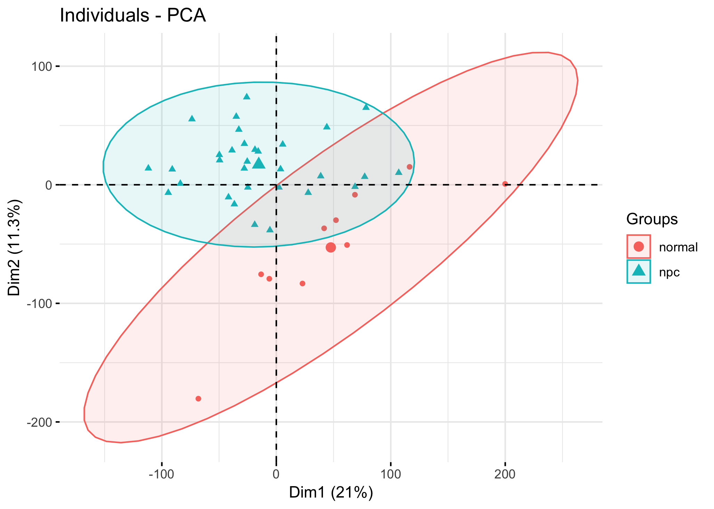
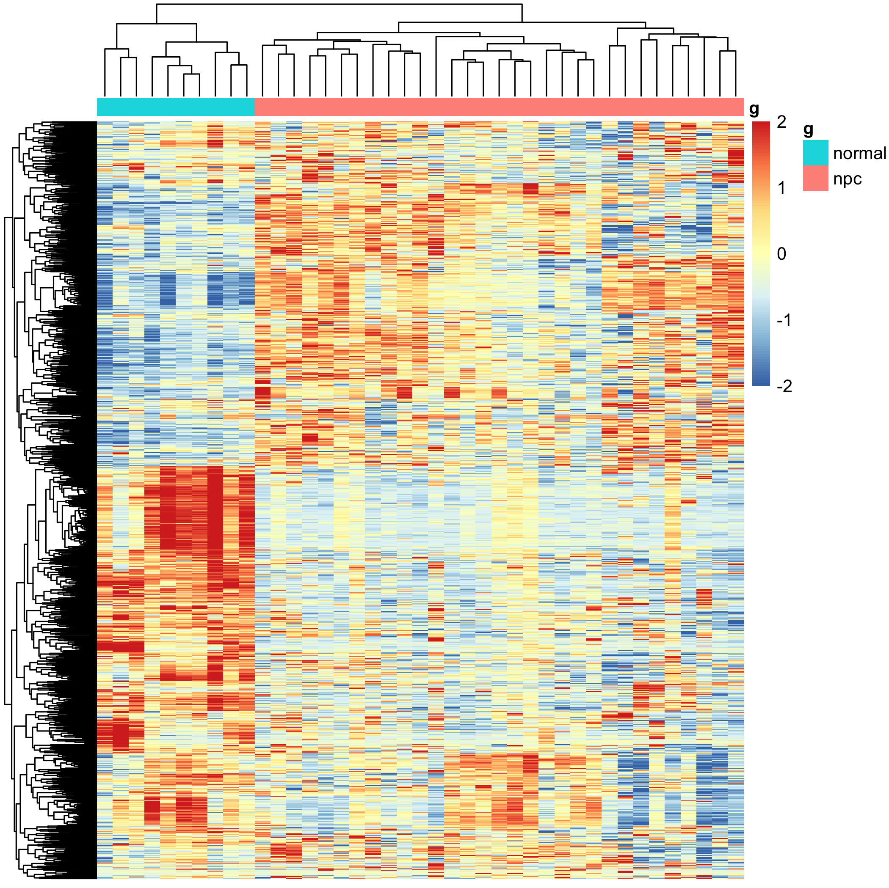
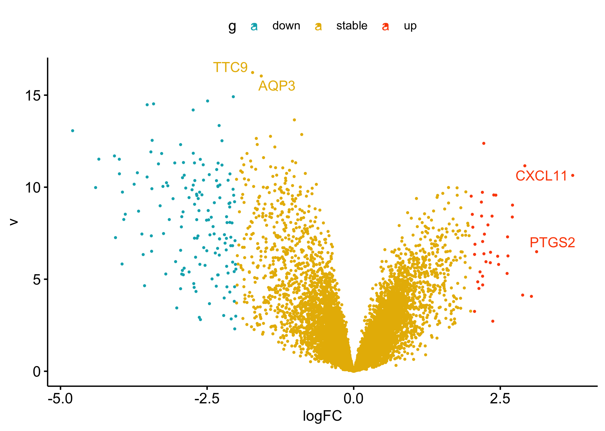

# 标准的肿瘤芯片差异分析

可以这么说，我这个GitHub项目里面的每个文件夹都是可以独立发表成为好几篇SCI的，两年前我公布给了所有的学员，然后现在陆陆续续看到一些文章被发表了：

- [Molecular Biology Reports](https://link.springer.com/journal/11033) 发表于 June 2019，题目是：The identification of key genes in nasopharyngeal carcinoma by bioinformatics analysis of high-throughput data 就是使用这个数据集走标准表达芯片差异分析，加上一个WGCNA
- 发表于  [Oncol Lett.](https://www.ncbi.nlm.nih.gov/pubmed/31289570#) 2019 Jul; 的文章：Investigation of differentially expressed genes in nasopharyngeal carcinoma by integrated bioinformatics analysis. 也是纳入了这个数据集，仅仅是走标准差异分析

数据集是：GSE12452 ，关于NPC的探索，鼻咽癌

下载数据集，看临床表型，是10个正常组织的对照，和31个NPC肿瘤组织的表达数据。

### 检查表达矩阵

根据表达量看PCA图，说明肿瘤样品和正常对照不同组区分的很好

 

同理，取SD值最大的1000个基因绘制热图，应该也可以得到同样的模，,肿瘤样品和正常对照不同组区分的很好

一般来说，对芯片表达矩阵，都是走limma得到差异分析结果，火山图如下：

### KEGG数据库注释

得到上下调基因后通常做一个KEGG数据库注释

可以看到**上调基因**集中于下面这些KEGG通路：

可以看到**下调基因**集中于下面这些KEGG通路：

可以看到**上下调综合的差异基因**集中于下面这些KEGG通路：

 

可以看到上下调基因分开做富集分析，是有意义的。

### 后续高级注释

包括GO数据库超几何分布检验，GSEA, GSVA分析，这里略过，运行时间会比较长，不过代码都在这里给到大家咯。

### WGCNA

